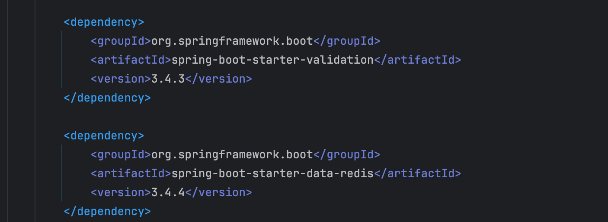
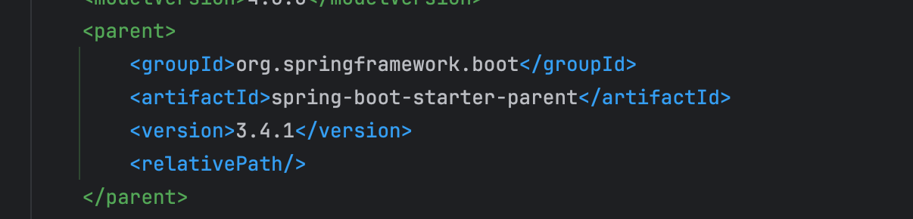
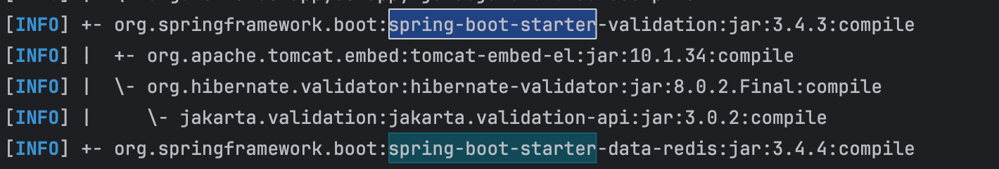
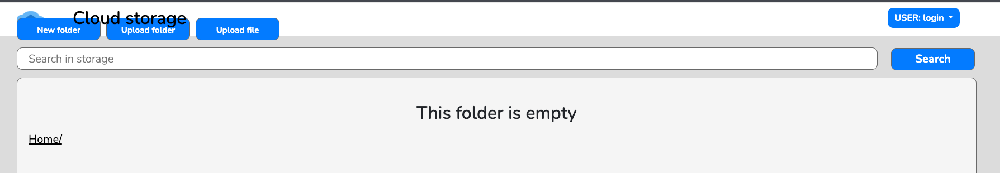
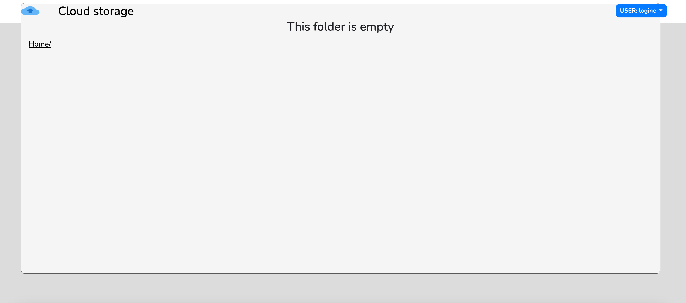
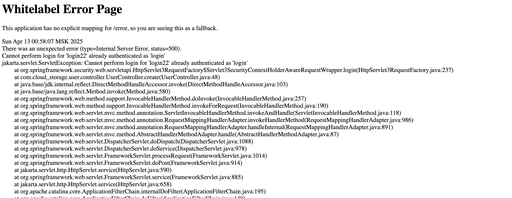
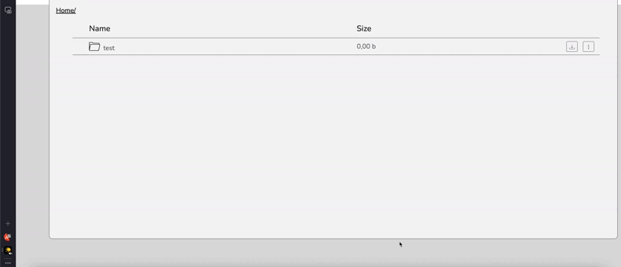
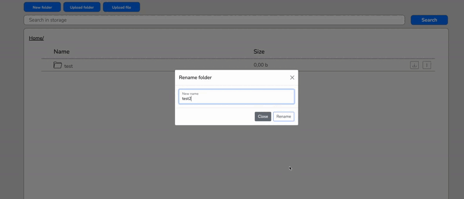

**Запуск проекта**

Проект сложный и его можно долго полировать, в ревью я не учитывал цели которые преследовал студент, я лишь указал на
проблемы которые увидел.

- Нет .env в репозитории
  Вообще для локальной разработки избыточно скрывать что-то кроме токенов публичных апи как в 5 проекте. Тут нечего
  воровать ведь окружение локальное.
- Нет докер компоуза для полного локального поднятия проекта, я имею ввиду где есть образ самого приложения.
- Нет собственно докер файла

В идеале приложение для локальной разработки полностью должно подниматься с одного клика.

Структуру проекта я оценивать не буду - тут вкусовщина, я больше привык к классической структуре.

Версии стартера не сходятся с версией бута




Командой mvn dependency:tree можно убедится что эти стартеры не переопределись,
это может вызвать проблемы с зависимостями, но конкретно в этом кейсе не вызвало,
тем не менее необходимость такого решения не ясна.



Хорошей практикой было бы сделать все Дто иммутабельными, используя @Value из ломбока или records.
То как это реализовано в UserCreateDto ErrorResponseDto аннотация @AllArgsConstructor - избыточно, @Value создаст
конструктор.

```java

@Value
@AllArgsConstructor
public class UserCreateDto {

    String username;

    String password;

    Role role;
}
```

Непонятно зачем столько аннотаций UserReadDto LoginDto @NoArgsConstructor - нигде не увидел создание с конструктором без
аргументов.
UserController - логер не используется но висит @Slf4j
Упали тесты при прогоне.

В createRootFolder - ловим все виды экспешенов,тут понятно.

Наследовать **StorageController** от BaseController ради двух методов - выглядит странно,
можно было бы просто сделать утильный статичный метод или приватным методом StorageController все равно они больше нигде
не используются. Опять же, непонтяно в чем заключается его "базовость", елси от
него во-первых не наследуются все контролеры, и методы в нем доволльно специфичные для одного лишь сценария, для одного
шаблона. М

**StorageController** - обработка и редирект в каждом методе в try catch блоке на шаблон error - шаблонный код,
можно было бы редиректить в адвайсе контроллере один раз для всех запросов и там же логировать,это было бы лаконичнее и
понятнее.

**Пример адвайса**

```java

@ControllerAdvice
public class GlobalControllerAdvice {
    @ResponseStatus(HttpStatus.INTERNAL_SERVER_ERROR)
    @ExceptionHandler(S3StorageServerException.class)
    public String S3StorageServerException() {
        return "error500";
    }

    @ResponseStatus(HttpStatus.NOT_FOUND)
    @ExceptionHandler(S3StorageFileNotFoundException.class)
    public String S3StorageFileNotFoundException() {
        return "error404";
    }

    @ResponseStatus(HttpStatus.TOO_MANY_REQUESTS)
    @ExceptionHandler(S3StorageResourseIsOccupiedException.class)
    public String S3StorageResourseIsOccupiedException() {
        return "error429";
    }

    @ResponseStatus(HttpStatus.CONFLICT)
    @ExceptionHandler(S3StorageFileNameConcflict.class)
    public String S3StorageFileNameConflict(S3StorageFileNameConcflict ex, Model model) {
        model.addAttribute("cause", ex.getMessage());
        return "error409";
    }
}
```

**StorageController** - указания действий в адресе является избыточным, для этого есть HTTP методы.

Можно выключить проверку компилятора на экспешены аннотацией из ломбока @SneakyThrows, что бы не мучаться при
прокидывании.

**MinioServiceTest** - minioClient не используется.

Хорошей практикой было бы создать какой нибудь класс со статичными методами, откуда вытаскивать тестовые данные по типу

```java
ObjectReadDto rootFolder = new ObjectReadDto("user-162-files", true, "/user-162-files/");
String name = "test";
String name1 = "1";
String name2 = "2";
String name3 = "3";
String path = "user-162-files/";
String path1 = path + name + "/";
String path2 = path1 + name2 + "/";
```

Каждый раз писать new ObjectReadDto("user-162-files",true,"/user-162-files/") довольно муторно.

Пример

```java
public class Stub {
    public static final String USERNAME = "SomeUserName";
    public static final String PASSWORD = "SomePassword";
    public static final Role ROLE = Role.USER;
    public static final User USER = new User(USERNAME, PASSWORD, ROLE);
    public static final LoginDto LOGIN_DTO = new LoginDto(USERNAME, PASSWORD);
}
```

Можно вообще не создавать переменные.а сразу использовать объекты, тк они изначально известны.

Создавать контейнер на время жизни одного теста излишне, если бы тестов было порядочно много, это все жутко тупило бы,
ну оно в таком виде и не работало бы никак, потому что как помещать в бин минио клиента порт непонтяно, ведь тестовый
класс это не бин, его не заинжектить
и минио контейнер не статичен ну оно и не работает о чем дальше.

```java

@BeforeEach
public void setUp() {
    minio = new MinIOContainer(DockerImageName.parse("minio/minio:latest"))
            .withEnv("MINIO_ROOT_USER", "minioadmin62")
            .withEnv("MINIO_ROOT_PASSWORD", "minioadmin62")
            .withCommand("server /data")
            .withExposedPorts(9000);
    minio.start();
}

@AfterEach
public void tearDown() {
    if (minio != null) {
        minio.stop();
    }
}
```

Можно было вынести пароль и логин в статичную переменную, чтобы было понятно что откуда берется.
Понятно, что один раз настроил и оно работает, но в случае проблем кто-то может долго искать откуда тянутся эти данные.

```java

@Bean
public MinioClient minioClient() {
    return MinioClient.builder()
            .endpoint("http://localhost:9000")
            .credentials("minioadmin62", "minioadmin62")
            .build();
}
```

```java

@BeforeEach
public void setUp() {
    minio = new MinIOContainer(DockerImageName.parse("minio/minio:latest"))
            .withEnv("MINIO_ROOT_USER", "minioadmin62")
            .withEnv("MINIO_ROOT_PASSWORD", "minioadmin62")
            .withCommand("server /data")
            .withExposedPorts(9000);
}
```

Почему это не работает? Тест Контейнеры каждый раз запускают минио на рандомном порте, а клиент у нас прибит к 9000,
нужно подставлять порт из контейнера в клиент в конфигурации.

**Например так:**

```java

@TestConfiguration
public class MinioServiceTestConfig {
    private MinIOContainer minio = new MinIOContainer(DockerImageName.parse("minio/minio:latest"))
            .withEnv("MINIO_ROOT_USER", "minioadmin62")
            .withEnv("MINIO_ROOT_PASSWORD", "minioadmin62")
            .withCommand("server /data")
            .withExposedPorts(9000);


    @Bean
    public MinioClient minioClient() {
        minio.start();
        return MinioClient.builder()
                .endpoint(minio.getS3URL())
                .credentials("minioadmin62", "minioadmin62")
                .build();
    }


    @Bean
    public MinioService minioService(MinioClient minioClient) {
        return new MinioService(minioClient);
    }
}
```

**Не критично но :**
Нет тестов на контроллеры, нет тестов на авторизацию, нет тестов на кеширование,
если разобрался на самом деле сделать не долго, разбираться все равно придется

**UserServiceTest** - то что я говорил сделано, сделаны шаблоны тестовых обьектов, если бы тестов было побольше, можно
было бы вынести в отдельный класс и переиспользовать.

**MinioService** - в целом перегружен ответственностями, это супер класс, который и соединяется с минио и делает какую
то логику над сущностями и выполняет инициализацию бакета и архивировать умеет.
isExist - обработка логики по сути через экспшен - плохая практика.

```java
    private boolean isExist(String folderName) throws MinioException {
    try {
        log.trace("Checking if folder exists in bucket: {}, folderName: {}", BUCKET_NAME, folderName);
        minioClient.statObject(StatObjectArgs.builder()
                .bucket(BUCKET_NAME)
                .object(folderName + "/")
                .build());
        return true;
    } catch (ErrorResponseException e) {
        if (e.getMessage().contains("Object does not exist")) {
            log.trace("Folder does not exist. Proceeding to create it.");
            return false;
        } else {
            throw new MinioException("Error while checking folder existence", e);
        }
    } catch (Exception e) {
        throw new MinioException("Unexpected error while checking folder existence", e);
    }
}
```

createBucketIfNotExists - ловишь рантайм экспешен конвертируя в бизнесовый MinioException,
но там могут быть и обычные Exception, которые протекут выше. Задумка непонятна.

```java
    public void createBucketIfNotExists() throws Exception {
    try {
        boolean isExist = minioClient.bucketExists(BucketExistsArgs.builder().bucket(BUCKET_NAME).build());
        if (!isExist) {
            minioClient.makeBucket(MakeBucketArgs.builder().bucket(BUCKET_NAME).build());
            log.info("Bucket:{} created successfully", BUCKET_NAME);
        } else {
            log.info("Bucket:{} already exist", BUCKET_NAME);
        }
    } catch (RuntimeException e) {
        throw new MinioException("Error to create a bucket", e);
    }
}
```

Лучше вынести интеграцию с минио в отдельный класс, как реализацию какого нибудь s3ConnectorClient :

- будет возможно подменять минио на другой S3 клиенты
- будет возможно логировать удобно через аспекты
- мок тесты будут тоньше и понятней, их тоже не надо будет рефакторить при смене минио на другой с3
- интеграционные тесты станут тоньше и понятнее и проще

Понятно что в рамках задачи написать 6 проект на минио, никто не будет менять клиент к s3, но мы ведь учимся, и лучше
понимать это, ведь вопросы на собесе будут примерно об этом. Могут попросить спроектировать какой нибудь логер как
аналог sl4j, можно посмотреть как он устроенно внутри там очень много разделений и абстракций и возможности
расширения. Тут же такого нет. Тут один цельный класс, который только целиком переписывать.

**Функциональное тестирование**

- Фронт съехал и надпись Cloud Storage закрывает кнопки
- 
- В этом кейсе вообще не видно - другой браузер
- 
- При удалении файла с русскиими буквами и андерскором запрос delete повисает с ошибкой -
  `The Unicode character [О] at code point [1,054] cannot be encoded as it is outside the permitted range of 0 to 255`
- При загрузки папки и удалении оттуда файлов,сама папка тоже удаляется
- При удалении папок у нас остается в браузере строка с путем к этой папке, хотя папки этой уже нет
- Авторизованному пользователю доступны формы входа и регистрации, при регистрации получаем
  `Cannot perform login for 'logine' already authenticated as 'login'`
  и видим необработанный стектрейс на фронте
  


- Можно скачивать удаленные папки, - там просто пустой файл c ошибкой открытия.
- 

- Рейс кондишен при переименования папок.
- 

Как легко воспроизвести - добавь Thread.sleep(5000);:

```java

@SneakyThrows
public void renameObject(ObjectRenameDto renameDto, ObjectReadDto rootFolder) throws MinioException {
    try {
        ValidationUtil.validate(renameDto);
    } catch (RuntimeException e) {
        throw new InvalidParameterException(e.getMessage());
    }
    renameDto.setPath(PrefixGenerationUtil.generateIfPathIsEmpty(renameDto.getPath(), rootFolder));

    if (renameDto.getIsDir().equals(String.valueOf(true))) {
        copyFolder(renameDto, renameDto.getPath(), rootFolder);
        Thread.sleep(5000);
        deleteObject(renameDto.getPath() + renameDto.getOldName() + "/");
    } else {
        copyFile(renameDto, renameDto.getPath());
        deleteObject(renameDto.getPath() + renameDto.getOldName());
    }
}
```

**Функциональные проблемы из чеклиста:**

- Возможность попасть в несуществующую папку, вместо того чтобы увидеть ошибку 404
- Низкие лимиты на максимальный размер загружаемого файла или папки

Позитивные моменты по итогу:

- Научился работать с .env
- Проект полностью функционален
- Нет дыр в безопасности
- Большой лайк за то, что в интеграционных тестах поднимается не весь контекст целиком, а разобрался как все таки
  поднимать только нужную часть.
- Проект был задеплоен.
